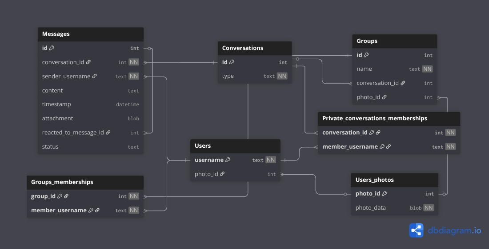

# WASA
## 17-02-2026 project passed on 30/30  
### This is a repository for the WASAtext project
[*Web And Software Architecture*](https://gamificationlab.uniroma1.it/en/wasa/) is a course I have been attending at Sapienza University of Rome during the academic year 2025/2026 as part of my Erasmus+ exchange program.  

The main goal of the course is to create a web application project called *WASAtext*, which is a basic communication platform that allows users to send messages, create channels, and interact with each other. 

The project is developed stage by stage according to the course syllabus: 
1. define APIs using the OpenAPI standard
2. design and develop the server side (“backend”) in Go
3. design and develop the client side (“frontend”) in JavaScript
4. create a Docker container image for deployment

The structure of the repository is imposed by the course requirements and is based on [fantastic coffee decaffeinated](https://github.com/sapienzaapps/fantastic-coffee-decaffeinated).

----

## 1. OpenAPI

All API endpoints and schemas are defined in the *OpenAPI* specification.  
For a convenient graphical representation of all resources, please open:

[Graphical API Documentation](https://tmpkl.github.io/WASA/) built using the [*Redoc CLI*](https://redocly.com/docs/cli)


## 2. Backend and Database
The backend is implemented in Go and is located in the `service` directory, with the main entry point in `cmd/` directory.

The backend uses a SQLite database to store user data, and the database is created using migrations in `service/database/migrations/`.


----

The backend exposes the API endpoints defined in the OpenAPI specification and handles requests from the frontend.

According to the Go ideology (as far as I get it), the methods responsible for handling API requests are located in the `service/api` directory, while the database interactions are handled in the `service/database` directory. This part of the code is implemented using interfaces to allow for easy swapping of database implementations if needed.

According to the course requirements, I use bearer tokens for user authentication, which are generated using the `github.com/golang-jwt/jwt/v5` package. 

Database operations that involve multiple related changes are wrapped in **transactions** to ensure data consistency and atomicity.

For simplicity, **images are stored directly in the database as BLOBs**. While this approach works fine for a small-scale project like this, it's not recommended for production systems where a dedicated file storage would be more appropriate.

All uploaded images are **processed and resized to 200x200px squares** using the `github.com/disintegration/imaging` library. This ensures consistent dimensions for profile pictures and group photos, making them lightweight and easy to serve to the frontend.

Depending on the endpoint, the API accepts either **JSON** or **multipart/form-data** request bodies. File uploads (photos, attachments) require form-data, while other operations use JSON. The expected format for each endpoint is specified in the `api.yaml` OpenAPI specification.

## 4. Docker
The application is containerized using Docker. The `Dockerfile.backend` and `Dockerfile.frontend` files are used to build the backend and frontend images, respectively.

1. TO build the frontend image, run:
    ```
    docker build -t wasatext-frontend:latest -f Dockerfile.frontend .
    ```
    to run it locally:
    ```
    docker run -it -p 8080:2137 --rm wasatext-frontend:latest
    ```
2. To build the backend image, run:
    ```
    docker build -t wasatext-backend:latest -f Dockerfile.backend .
    ```
    to run it locally:
    ```
    docker run -it -p 8081:3010 --rm wasatext-backend:latest
    ```
    Remember to set correct ports in order to connect frontend with backend!
    I didnt set cuz docker is only for grading purposes. If I were to host it somewhere, I would use docker-compose to manage both containers and their networking.